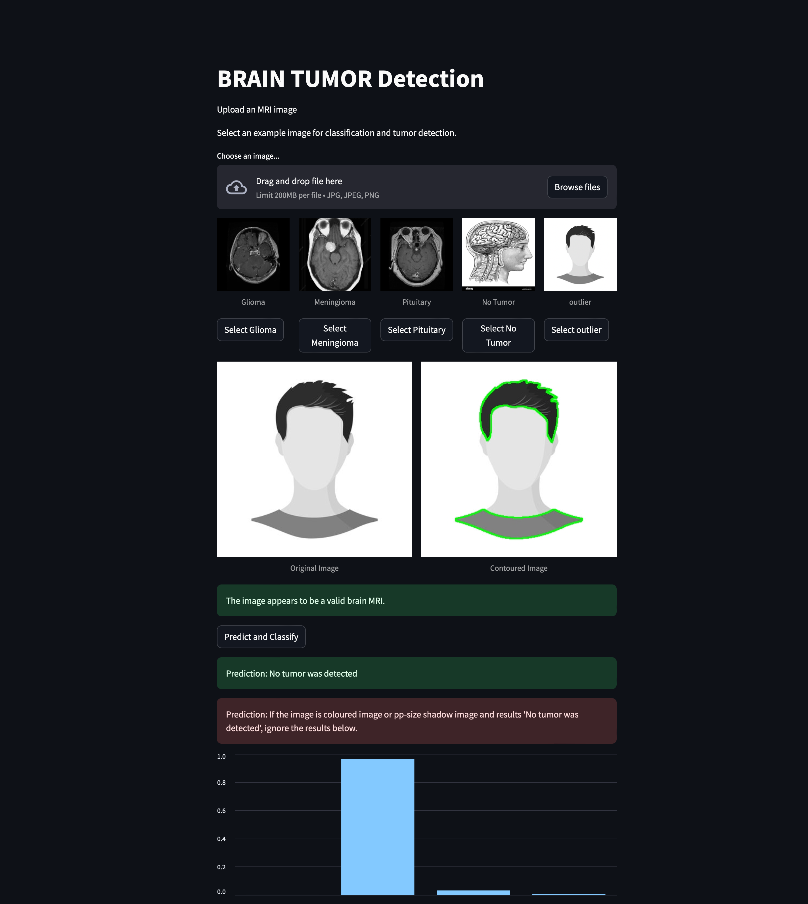
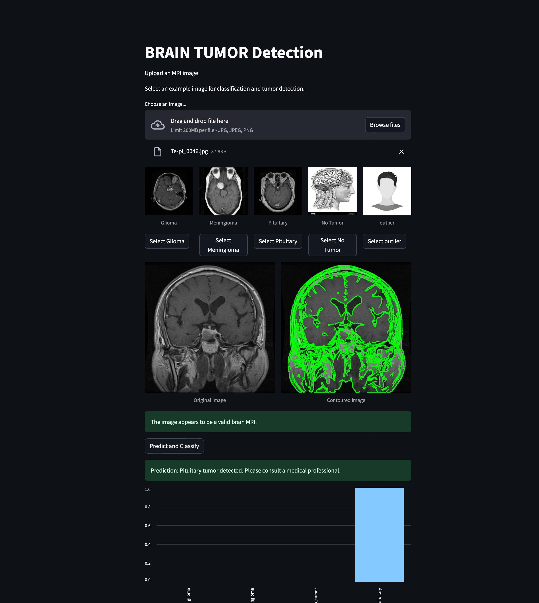

# BrainTumorDetection with StreamLit UI
I created this project by fine tuning the pretrained model [Efficientnet_V2_small](https://pytorch.org/vision/stable/models/efficientnetv2.html) with [Brain Tumor Classification Dataset](https://www.kaggle.com/datasets/masoudnickparvar/brain-tumor-mri-dataset) with Tools such as [Pytorch](https://pytorch.org) [torchvision](https://pytorch.org/vision/stable/index.html) and [Streamlit](https://streamlit.io).


## IF you want to use the App in your system locally you can follow the tutorial.

## MRI Image Classification App

This tutorial will guide you through setting up the MRI Image Classification app locally. The app allows users to upload MRI images, predict classifications, and visualize results, including tumor contouring.

## Features

- **Upload MRI Image**: Allows users to upload an MRI image for classification.
- **Prediction**: Classifies MRI images into four categories.
- **Contour Detection**: Displays the original and contoured images side by side.
- **Graph**: Display the confidence graph.

## Prerequisites

Before you begin, make sure you have the following installed:

1. **Python 3.7+**
2. **Streamlit** (`pip install streamlit`)
3. **PyTorch** (`pip install torch torchvision`)
4. **Other Dependencies**: Run the following to install all necessary dependencies:

   ```bash
   pip install -r requirements.txt
   ```

## Local Setup

### Step 1: Clone the Repository

```bash
git clone https://github.com/AashishTangnami/BrainTumorDetection.git
cd your-repo-name
```

### Step 2: Install Dependencies

Make sure you have all the dependencies installed by running:

```bash
pip install -r requirements.txt
```
If the installation throws any errors then replace all the dependencies in requirements.txt with following requirements.

```
torch
torchvision
streamlit
pillow
watchdog
opencv-python

```

### Step 3: Run the Streamlit App

To start the app locally, use the following command:

```bash
streamlit run ['file_name.py']
```
In my case it's
```
streamlit run brain_tumor_streamlit_ui.py
```
Once the app is running, you should see an output like this in your terminal:

```bash
  You can now view your Streamlit app in your browser.

  Local URL: http://localhost:xxxx
  Network URL: http://your-ip-address:xxxx
```

Open your browser and navigate to `http://localhost:xxxx` to view the app.

### Step 4: Upload an MRI Image

1. The UI will prompt you to upload an MRI image. Click on the **"Browse files"** button, select your MRI image, and click **"Open"**.
   
   

2. After the image is uploaded, the app will display the original MRI image on the left and the contoured image on the right.

   Outlier

3. If the uploaded image is detected as an outlier (not related to MRI), the app will notify you that it is not an MRI image.

### Step 5: Classification and Tumor Contouring

Once the image is uploaded, click the **"Predict"** button. The app will:

- Display the predicted class of the MRI image.
- Show the original MRI image and the corresponding contour of the tumor (if detected) side by side.

   

### Step 6: Select Existing Image for Prediction

If you want to select an existing MRI image (one you previously uploaded), you can choose it from the list, and the app will predict and contour it again, ignoring the previously uploaded image.

---

## Additional Notes

- Make sure that the MRI image is in a proper format (PNG, JPEG , JPG) and the size matches the model’s input requirements.
- The app is designed to handle images that are outliers by ignoring non-MRI images.
- The application is optimized for local runs but can be deployed on cloud platforms like Hugging Face Spaces or Heroku.

---
## NOTE:
- The model cannot generalize the prediction for progduction grade.
- For better results you can customize your features with more classes that labels images as non-mri-images and more and good luck re-training the model if you do not have good GPU 😂.

This tutorial walks you through the steps of setting up and using the MRI Image Classification app locally. 

